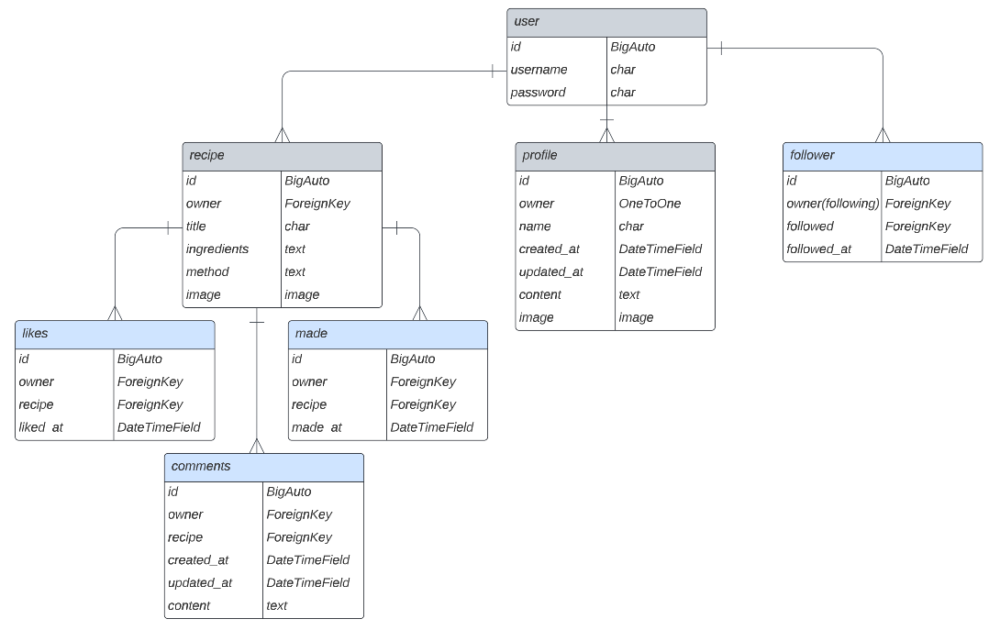

# Genshin Food Blog API

Genshin Recipes Blog is a community blog created to allow players of the game to share the in-game recipes they have created in real life. Although aimed at the community, the recipes are enjoyable by anyone.

This repository houses all the back-end functionality for storing user data sent from the client site.

All models have been registered with the admin site so they are controllable there.

The site has full CRUD functionality to allow creation, reading, updating & deletion.

The landing page for this API displays the message "welcome to the Genshin food blog api".

Further documentation, including user stories, agile methodology, design reasoning & implementation, main site testing etc. can be found in the ReadMe for the Client Site, [here](https://github.com/charlie-vf/genshin-recipes-blog)

This ReadMe will document API-specific content.

# Table of Contents
- [Admin](#admin)
- [Apps](#apps)
- [Testing](#testing)
- [Future Features](#future-features)
- [Technologies & Packages](#technologies--packages)
- [Deployment](#deployment)

## **Admin**

The first step in this site was to set up the admin panel to monitor storage of data and create example data to ensure URLs worked accordingly in the backend.

The superuser details are:
- username: felix
- password: 5863Lune

## **Apps**

### Entity Relationship Diagram



### genshin_api

This is the main app, containing the settings, main urls, logout_view & permissions.

To ensure functionality of the client site, the settings contain relevant information on Cloudinary image storage, JWT access tokens, CORS access headers, Database storage and necessary installed apps, both exterior and from within this project.

The code for the logout_view was necessary to fix a recurring issue with dj-rest-auth and was provided in the walkthrough for Code Institute's PP5 practice project.

### recipes

This is the app for holding data on user created recipes. It ensures full CRUD functionality for recipes. 

The model contains generic fields, such as owner and created_at, as well as fields specific to this blog, such as ingredients and method.

The serializer contains all necessary fields for displaying data, counting (likes, made, comments) as well as restrictions on image upload sizes to prevent users uploading incompatible images which would hinder performance and experience. The restrictions raise appropriate error messages if an image does not validate.

There are two views:
- One for displaying all recipes (RecipeList) which is a ListCreateAPIView & lists all recipes and allows the user to create recipes if they are logged in. It prevents access to the create option if the user is not authenticated (not logged in).
- One for editing/deleting recipes (RecipeDetail) which is a RetrieveUpdateDestroyAPIView and allows a logged in user to edit and/or delete the content of their recipes. It uses the appropriate permission to prevent access to this functionality if the user does not own the recipe.

### profiles

This app holds data on user profiles. It allows users to create and update their profiles, including adding bios (field: content in model).

The serializer allows tracking of number of recipes, followers and following which are displayed on the user's profiles on the client site.

If the user does not choose to edit their profile with a new image, it will be set to a default image which is the same as the Recipe Blog's logo.

### likes & made

These apps contain models to allow users to like recipes and mark them as made, with the relevant back-end data updating accordingly. These are used for the favourites and made pages in the client site, with ordering set to created date in descending order.

Both contain handlers to prevent users from marking the same recipe as liked/made twice, allowing for unliking/unmaking functionality in the front-end site.

The made model was initially set to include more functionality, including commenting and rating specific to when this icon is selected on the client site, however technical difficulties presented by my laptop breaking put a hold on development for a week and, thus, this model was restricted significantly in order to ensure the website was still fit for deployment. These issues are also detailed in the ReadMe for the front-end Genshin Recipes Blog under 'Future Features'.

### comments

This app handles commenting functionality. As with all other models, comments are displayed in descending order with the most recent first.

The first serializer allows comments to display the user's name & profile image, and the time the comment was created (or updated). It uses django's naturaltime import to display the date in a more readable manner. The second allows the editing option to auto-fill to make things easier for the user.

### followers

Handles following/unfollowing functionality.

This app was unfortunately not fully implemented in the client site due to the previously mentioned issue of a broken laptop. The app contains functionality to display a followers list in order of most recently followed, with error handling to prevent a user following the same user twice.

This was intended to be used in a page accessible from clicking the 'following' detail in the user stats on the client site. Following marking of this project, this will be implemented fully.


## **Testing**

Following initial automatic and manual testing pre-development of the client site, the majority of testing was completed via the main client site.

Initial testing inside this project can be found in the test.py files inside the recipes and profiles folders.

### PEP8

All python code passes through Code Institute's [Python Linter](https://pep8ci.herokuapp.com/) with no errors.


### Client-BackEnd cross-testing

1. Profiles

A profile was created using the Sign Up option on the client site and cross-checked in the API's [profile URL](https://genshin-food-blog-api.herokuapp.com/profiles/).

Through this, I ensured new profiles were successfully created and stored in the back-end, as well as relevant features such as whether the user logged in is the owner(is_owner), biography (listed back-end as 'content'), number of recipes, number of followers, number of followed users, and profile image.

Editing profile data was tested by performing the action in the client site and cross-checking it against the stored data in the back-end.

2. Recipes

A recipe was created using the Create Recipe option on the client site and checked with the [recipes list](https://genshin-food-blog-api.herokuapp.com/recipes/) displayed in the back-end.

Through this, I ensured new recipes were successfully created and stored in the back-end, with all relevant fields present & storing the correct data, e.g. title, ingredients. image, number of likes, creation data, is_owner etc and that they are associated with the correct profiles.

Editing and deleting recipe data was, again, tested by performing these actions client-side and checking they have occurred correctly in the API site.

3. Liking, marking as made & commenting on recipes.

Again, this was tested by performing the above actions on a recipe the logged in user of the client site does not own and checking the relevant changes occured back-end.

All field data declared in models displays correctly and updates in real-time.

Likes:

- /likes
- Can like a recipe the user does not own & like_count will increase by 1
- Can unlike a recipe the user does not own & like_count will decrease by 1
- Cannot like a recipe the user owns & warning message is displayed
- Likes display in admin site at /admin/likes
- Newly liked recipe added to favourites page on client site

Made:

- /made
- Can mark any recipe as made
- made_count will increase by 1
- Mades display in admin site at /admin/made
- Newly made recipe added to made page on client site

Comments:

- /comments
- Can comment on any recipe
- Comments display in admin site at /admin/comments
- comments_count will increase by 1

Followers:

- /followers
- Can follow other users
- Can unfollow other users
- Can change the owner of the follow and who they are following
- Followers display in admin site at /admin/followers
- Recipes from followed users display on following page on client site

Via /admin, the admin superuser has full control over all actions on the site.

## **Future Features**

- These are detailed in the Apps section above, as well as the Genshin Recipes Blog repo, and namely revolve around features I ran out of time to implement due to technical issues.
- One extra feature I would like to implement is social media sign in, as this is such a common feature of other sites it feels necessary to include it. The relevant packages have already been installed alongside other all-auth.

## **Technologies & Packages**

- GitHub, Git, GitPod & Heroku for code writing, version control & deployment
- Django - primary language
- Django Rest Framework - primary language
- Django allauth - authentication
- Django filters - data filtering
- Cloudinary - image storage
- ElephantSQL - database
- psycopg2 - database
- Pillow - imageField
- Gunicorn - corsheaders
- SimpleJWT - tokens

## **Set Up & Deployment**

This API project was created using a GitPod workspace, commited to Git, pushed to GitHub and deployed on Heroku. It is designed to work in conjunction with a front-end site.

As this project uses django, external database, Cloudinary & Pillow, the following steps will detail how to install and link these.

Before final deployment, ensure:

- Debug is off in settings.py
- You have created a Procfile with the relevant information, e.g. web
- Your requirements.txt file is up to date
- You have migrated all models
- Your secret key is hidden

Environment Set-Up:

To complete the following steps in Heroku, you will first need to:

- Clone/Fork this repository:
    - Beneath the repository name, click 'Code' and copy the clone HTTPS
    - Open your preferred IDE & navigate into the working directory you wish to clone into
    - Type 'git clone', paste the copied HTTPS & press enter

- To setup with external database and image cloud storage: 
    - Visit ElephantSQL.com and create/login to your account
    - Select 'Create New Instance', choose a name, select TinyTurtle & tags can be left blank
    - Select the region which aligns with your location
    - Click 'review' to check information, then click 'Create Instance'
    - Navigate to this new database and make note of the database URL
    - Visit Cloudinary.com and create/login to your account
    - Navigate to your Dashboard and make note of your API Environment Variable

In Heroku:

- Login/Create a new account
- Select New App
- Choose App name and region
- Select Deploy & link to correct GitHub repository
- Manually deploy site (can choose automatic deployment after this, if desired)
- Select Settings -> Reveal Config Vars
- Add the following:
    - ALLOWED_HOST: URL for deployed API site
    - CLIENT_ORIGIN: URL for deployed client site (if created)
    - CLIENT_ORIGIN_DEV: URL for client site active workspace (if created)
    - CLOUDINARY_URL: your Cloudinary API Environment Variable
    - DATABASE_URL: your ElephantSQL database URL
    - SECRET_KEY: the secret key you created in your workspace env.py file (see below)

In the project workspace:

- Install django with the command 'pip3 install 'django<4''
- Install Cloudinary with the command 'pip3 install django-cloudinary-storage'
- Install Pillow with the command 'pip3 install Pillow'
- Install psycopg2 with the command 'pip3 install dj_database_url==0.5.0 psycopg2' to allow you to connect to your external database on ElephantSQL
- Install gunicorn with command 'pip3 install gunicorn django-cors-headers'
- In env.py (create if haven't already), add 'import os' and add:
    - os.environ['CLOUDINARY_URL'] = ['your cloudinary URL']
    - os.environ.setdefault('SECRET_KEY', 'your secret key')
        - you can create a new secret key in the terminal using the command 'python -c "import secrets; print(secrets.token_urlsafe())"'
    - os.environ.setdefault("DATABASE_URL", 'your ElephantSQL database URL')
- In settings.py:
    - import dj_database_url
    - import os
    - add:

        ```
            if os.path.exists('env.py'):
                import env
        ```

    - update DATABASES with:

        ```
        if 'DEV' in os.environ:
            DATABASES = {
                'default': {
                    'ENGINE': 'django.db.backends.sqlite3',
                    'NAME': BASE_DIR / 'db.sqlite3',
                }
            }
        else:
            DATABASES = {
                'default': dj_database_url.parse(os.environ.get("DATABASE_URL"))
            }
        ```
    - add

        ```
        CLOUDINARY_STORAGE = {
            'CLOUDINARY_URL': os.environ.get('CLOUDINARY_URL')
        }
        ```

        and 

        ```
        MEDIA_URL = '/media/'
        DEFAULT_FILE_STORAGE = 'cloudinary_storage.storage.MediaCloudinaryStorage'
        ```

    - add 'corsheaders.middleware.CorsMiddleware', to the top of MIDDLEWARE
    - below MIDDLEWARE, add:

        ```
        if 'CLIENT_ORIGIN_DEV' in os.environ:
            extracted_url = re.match(r'^.+-', os.environ.get('CLIENT_ORIGIN_DEV', ''), re.IGNORECASE).group(0)
            CORS_ALLOWED_ORIGIN_REGEXES = [
                rf"{extracted_url}(eu|us)\d+\w\.gitpod\.io$",
            ]
        ```
    - add to installed apps:
        - 'cloudinary_storage',
        - 'cloudinary',
        - 'corsheaders',
    - remove value for secret key and replace with:
        - SECRET_KEY = os.getenv('SECRET_KEY')
    - update ALLOWED_HOSTS to:
        - ALLOWED_HOSTS = [os.environ.get('ALLOWED_HOST'), 'localhost']
    - set debug to:
        -  DEBUG = 'DEV' in os.environ

        or

        - DEBUG = False
- Create a Procfile and add:
    - release: python manage.py makemigrations && python manage.py migrate
    - web: gunicorn [your main app name].wsgi
- Ensure you update your requirements.txt with pip freeze > requirements.txt
- Ensure you migrate with python manage.py makemigrations and python manage.py migrate
- Add, commit & push changes
- Manually deploy on Heroku again (not necessary if enabled automatic deployment)

## **Issues**

Resolved:

- Sign Out functionality not working
    - this was due to missing 'response' in logout_route return

## **Credits**

- Slack for endless troubleshooting support in a way which made sense, largely revolved around helping me spot small things I had missed, for example forward slashes
- Stack Overflow for helping with issues with CORSHeaders